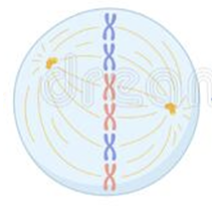
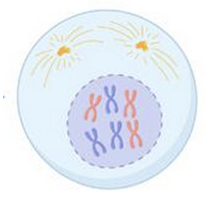

# Homework Answers  

Identify which phase of mitosis is described by each of the statements below.  
**Anaphase**  
This is the phase when the sister chromatids are detached from one another.  
**Telophase**  
This is the phase when a new nuclear membrane begins to form around the divided chromosomes.
**Metaphase**  
This is the phase when the chromosomes line up along the center of the cell.  
**Prophase**  
This is the phase when DNA condenses into chromosomes. 
This is the phase when the nuclear membrane begins to break down. \ 

Which kind(s) of cells store genetic information in plasmids?  
Only prokaryotic cells  

Which of these images shows a cell in metaphase?

Which of these images shows a cell in prophase?

Which of these is NOT a part of Interphase?    
The M phase

The condensed form of DNA that is seen when a cell prepares to divide is called ______? 
chromosomes 

There are multiple checkpoints that a cell must pass through in order to divide.  
Which checkpoint "checks" the external environment to determine if there would be enough nutrients available for a new cell to grow?   
The $G_1$ checkpoint  

A cell that has two copies of each chromosome is considered   
diploid  

True or false?  
Non-cancerous cells must be attached to a growth surface to undergo mitosis.  
True  

Human sperm cells are an example of a _______
Human sperm cells are ______ cells.  
gamete, haploid  

Put the phases of a cell's life cycle in order, from "birth" to division.
Birth (when a new daughter cell is formed)  
$G_1$ phase  
$S$ phase  
$G_2$ phase  
$M$ phase  

True or false?  
If the cell density is high (a.k.a. cells are tightly squeezed together), cancerous cells will still divide.  
True  

Which of these is NOT a part of Interphase?
The M phase

A cell that has one copy of each chromosome is considered  
haploid  

______ are pairs of chromosomes, each inherited from a different parent.  

There are multiple checkpoints that a cell must pass through in order to divide.  
Which checkpoint "checks" for the presence of growth factors in the environment around the cell? 
The $G_1$ checkpoint 

Which kind(s) of cells have pairs of chromosomes? \
Only eukaryotic cells

True or false?
Without external growth factors, non-cancerous cells will NOT undergo mitosis.
True

There are multiple checkpoints that a cell must pass through in order to divide.

Which checkpoint "checks" to see if the chromosomes in a dividing cell accurately attached to the mitotic spindle proteins?
The Metaphase checkpoint

Human muscle cells are an example of a ________     
somatic cell

Human muscle cells are ______ cells. \
diploid

During which phase do cells duplicate their organelles (to prepare for division)? \
The $G_2$ phase

Most of the cells in the human body (besides the reproductive cells) are considered \
somatic cells

The loose, stringy form of DNA seen in the nucleus of a cell is called \
chromatin

Human neurons are an example of a ______.\
Human neurons are _____ cells.\
gamete, haploid

Which kind(s) of cells use DNA as their genetic information molecule?\
Both prokaryotic cells and eukaryotic cells