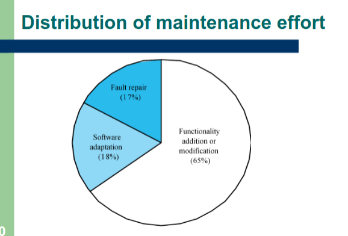
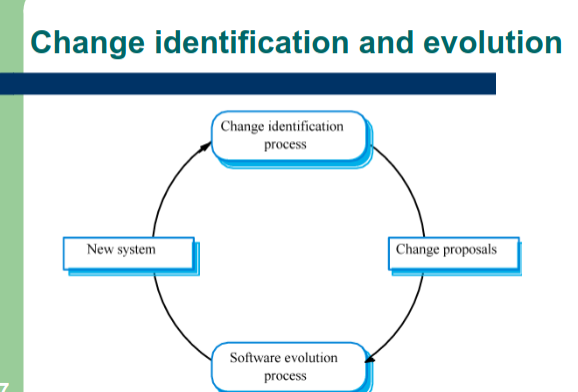
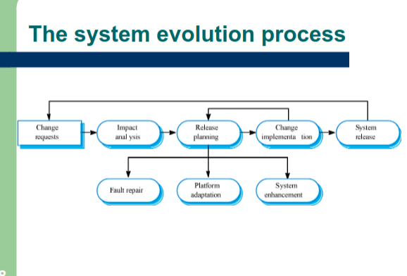

# Software evolution

## Software change

- Software change is inevitable
  - new requirements emerge when software is used
  - the business enviornments change
  - errors must be repaired
  - new computers and equipment is added to the system
  - the preformance or reliability of system may have to be improved
- A key problem for organizations is implementing and managing changes to their existing Software Systems

## Program evolution dynamics

- PED is the study of processe of system change

## Lehmans law

- continuing change
  - A program that is used in the real world must change progressivly to be useful
- Increasing complexity
  - As program evolves and changes its infrastructure becomes more complex
- Large program evolution
  - Program evolution is a self-regulating process.
- Organizational stability
  - Over a programs lifetime the rate of development is constant and independent of the resources devoted to it 
- Conservation of familiarity
  - The incremental change in each release is constant
- Continuing growth
  - The functionality has to continue to grow to maintain users
- Declining quality
  - The quality of the system will appear to be declining unless tehy are adapted to changes in their operational env.
- Feedback System

### Applicability of Lehmans Law

- Lehmans law seems to be generally applicable to large tailored systems dev. by large organizations 

- its not clear on how to modify
  - shrink-wraped software products
  - systemtshat incorporate a lot of COTS componenets
  - Small organizations
  - medium sized systems

## Software maintance

- Modifying a pogram after it has been put into use
- Maintance does not normally invole major changes
- Changes are implmented by modifying existing compontnents and adding new components to the system.

### Maintance is inevitable

- the sys requirements are likely to change while being developed because the enviornment is changing.
- Systems are tightyly coupled with their enviornment, when a system is installed in a new environemnt it changes that enviornment therefore it changes sys. req.
- Systems MUST be maintained therefore to remain useful to an enviornment

## Types of maintenace (IMPORTANT)

- Software Faults
  - Changing a system to correct deficiencies in the way meets its requirements
- Adapt software to a different operating environment
  - Changing a system so that it operates in a different enviornment(computer, OS, etc.) from its initial implementation
- Add to or modify the systems Functionality
  - modifying the system to satisfy new requirements

Possible questions:

- What are the 3 types of maintenaces
- Out of the 3 which are the most done

## Maintenance cost factors (IMPORANT)

- Team Stability
  - Maintenance costs are reduced if the same staff are involved with them for some time.
- Contractual Responsibility
  - The developers of a system may have no contractual responsibility for maintenance so there is no incentive to design for future change.
- Staff skills
  - Maintenance staff are often inexperienced and have limited domain knowledge.
- Program age and structure
  - As programs age, their strucutre is degraded and they become harder to understand and change.
  
## Complexity metrics

- Predictions of maintainability can be made by complexity metrics
- Complexity depnds on:
  - Complexity of control strucutes
  - complexity of data structures
  - Object, method (procedure) and module size

## Process Metrics

- Process measurements may be used to assess maintainability
  - Number of requerest for corrective maintenance
  - Average time required for impact analysis
  - Average time taken to implement a change request
  - Number of outstanding change requests
- If any or all of these are increasing, this may indicate a decline in maintainability

## Evolution processes

- Depends on...
  - The type of software being maintained
  - The development processes used
  - The skills and experience of people involved
  

**Know how to draw this**

## Urgent Change requests

- Urgent changes may have to be implements without going through all stages of SWE process
  - if a serious system fault has to be repaired
  - if changes to sys. env. (e.g. an OS upgrade) have unexpected effects
  - if there are business changes that require a very rapid response.
