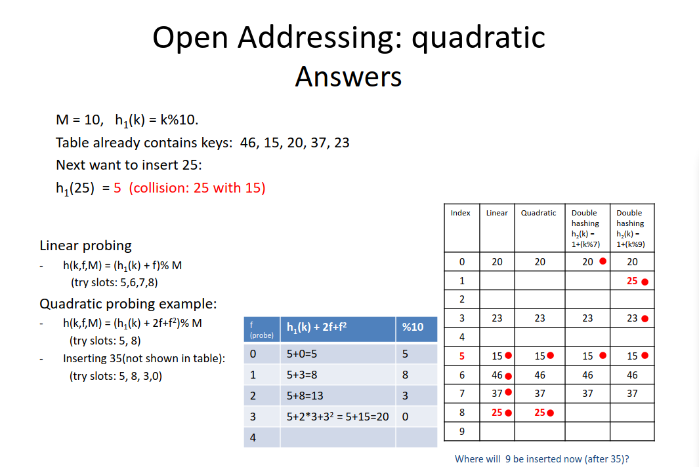

# FIFO Queues
* FIFO: First In First Out
* sort of like waiting in line at a restaraunt
* 2 implementations of this:
  * Single Linked Lists
  * Arrays

<badge type="info" text="Heres a visualization" />
--- 


* both implementations are essentially the same, just keeping track of the first and last nodes / idxs and updating their positions
* imo its easier with a single linked list

## HashTables
* Allows for searching data in constant time
* One of the 1st things to think of when trying to solve a search/lookup leetcode esq problem

$$
Pairs Of Key => Hash Value => index
$$

### Collision Resolution
2 items trying to go to the same cell

Solution: Linked lists

## Seperate Chaining
M = table size h(k) = k%m

* using a number like 10 as a size is a bad idea for hash tables
* we tend to use ***Prime Numbers***

Inserting data at beginning is good when new data is searched more frequently

Ratio between
M = table size: 10
N = Number of items in table: 6

$$
α = \frac{N}{M} = \frac{6}{10} = .6
$$
α = load factor

* When the load factor(α) goes past threshold
  * Resize it ! (usually multiply m by 2)
  * Good threshold size is .75

<badge type="info" text="Heres a visualization" />
--- 


## Resizing Tables

Ans: Double the space


M = 10 => m = 20 -> h(k,20) = k % 20

    | 0  |  |
    | 1  |  |
    | 2  |  |
    | 3  |  |
    | 4  |  |
    | 5  |  |
    | 6  |  |
    | 7  |  |
    | 8  |  |
    | 9  |  |
    | 10 |  |
    | 11 |  |
    | 12 |  |
    | 13 |  |
    | 14 |  |
    | 15 |  |
    | 16 |  |
    | 17 |  |
    | 18 |  |
    | 19 |  |

Once resized, ***Rehash*** all items from original table to new table

TC: θ(N + M)
* Have to go through N Linked lists & size of M table

**How to initialize without resizing**


expected N = 100 & α = 0.7

$$
α = \frac{N}{M} < 0.7 => N < 0.7 * M => M > \frac{N}{0.7} = 142.83...
$$

M >= 143 (You should pick a prime number to be you M)

## Hash Functions
<badge type=info text="Mod = %" />

$$
h(k,M) = K (mod) M
$$
- M should be a prime number
$$
h(k,M) = floor((k-a)/(b-a) * M)
$$
- simple if random key
- A <= k < B
$$
h(k,M) = floor(k*A mod 1)
$$
- 0 < A < 1
- good A = golden ration = 1.61803399
- Good wehn m is not prime, (m = power of 2)

## Open Addressing
- use empty cells in the table to store colliding elements
- M > N
- α - ratio of used cells from the table ( < 1)
- Probing - examining slots in the table. 
- Number of probes = number of slots examined.
- h(k,f,M) where f gives the number of failed probes/attempts
  - f=0,1,2,3... until successful hash

### Linear probing
$$
h(k,f,M) = (h1(k) + f) (mod) M
$$
* if the slot where the key is hashed is taken, use the next available slot and wrap around the table.
* Very bad method:
  * This causes <u>***Primary Clustering***</u> or long chains; creating a snowball effect: the longer the chain, the higher the chance to grow

### 3 rehash (linear)
$$
h(k,f,M) = (h1(k,M) + 3f) (mod) M
$$
* Bad method: <u>***Secondary Clustering***</u>
  * if two keys hash to the same value they follow the same set of rpobes. But better than linear
* (this can be done with a different # multiplied rather than three) (e.g. 9f)

### Quadratic Probing
$$
h(k,f,M) = (h1(k) + c1f + c2f2) (mod) M
$$
* Bad method: <u>***Secondary Clustering***</u>
  * if two keys hash to the same value they follow the same set of rpobes. But better than linear

### Double Hashing
$$
h(k,f,M) = (h1(k,M) + f * h2(k,M)) (mod) M
$$
* h2(k,M) <u>should NEVER be 0</u> (e.g. use: h2(k,M) = 1 + k %(M-1))
* Use a second hash value as the jump size ( as opposed to size 1 in linear probing).
* Want: h2(k) relativly prime with M. (Relatively prime = they have no common divisor)
  * M prime and h2(k,M) = 1 + k % (M-1)
  * M = 2^p and h2(k,M) = odd M and h2(k) will be relatively prime since all the divisors of M are powers of 2, thus even.

```
k=25 m=10
h1(25,10) = 25 % 10 = 5
h2(25,10) = 1 + 25 % (10-1) = 8
--------------------------------
h(25,f,10) = (5 + f * 8) % 10
h(25,1,10) = (5 + 1 * 8) % 10 = 3
h(25,2,10) = (5 + 2 * 8) % 10 = 1
```

## worksheet on how each of the addressing methods work


### Two Sum
<badge type="info" text="This is an leetcode side problem"/>

[2,3,5,7,11,15] target = 9
* at 5 search for 4 in hashtable if found, found solution!
* if not put 5 at idx 2 (5,2) -> (nums[j], j)

start with empty hashtable
```
idx = idx# => val => search for target-val => found/not => insert/return

idx = 0 => 2 => search for 9-2=7, not found => insert (2,0) in table
idx = 1 => 3 => search for 9-3=6, not found => insert (3,1) in table
idx = 2 => 5 => search for 9-5=4, not found => insert (5,2) in table
idx = 3 => 7 => search for 9-7=2, found => (2,0) return (3,0)
```

* here in the hash table we put pairs of (key, one piece of info) (key,idx)
* but there could be different types of cases:
* (key, collection) or (key, count)

## Search and Deletion in Open Addressing

Searching:
* Report as not found whe landing on an empty cell
Deletion:
* Mark cell as 'DELETED', not as an EMPTY cell
  * otherwise you break the chain and not be able to find elements following in that chain.
  * E.G. with linear probing, adn hash function (h,i,10) =(k+i)%10, insert 15,25,35,5, search for 5 then delete 25 and search for 5 or 35

| idx | linear | operations                   |
| --- | ------ | --------------------------   |
| 0   | 20     | search for 35 => 35 % 10 = 5 |
| 1   |        | insert 35 => idx 9           |
| 2   |        | delete 25                    |
| 3   | 23     | search 35 =? idx 5,6,7,8? no |
| 4   |        | cont. =>                     |
| 5   | 15\*   | X = deleted                  |
| 6   | 46\*   | * = visited                  |
| 7   | 37\*   |                              |
| 8   | 25\* X |                              |
| 9   | 35     |                              |

* When deleting you need to mark that the data was deleted

## Expected TC for hash operations 
<badge type="info" text="This is under 'perfect' conditions" />

| Operation \ Methods  | Separate chaining | Open Addressing |
| ------------------   | ----------------  | --------------- |
| Successful search    | Θ(1+α)            | (1/α)ln(1/(1-α))|
| Unsuccessful search  | Θ(1+α)            | 1/(1-α)         |
| Insert               | Θ(1) When: insert at beginning and no search for duplicates | 1/(1-α) |
| Delete               | Θ(1) Assumes: doubly-linked list and node with item to be deleted is given.| The time complexity does not depend only on α, (but also on the deleted cells). In such cases separate chaining may be preferred to open addressing as its behavior has better guarantees. |
| Perfect conditions |  simple uniform hashing | uniform hashing |

