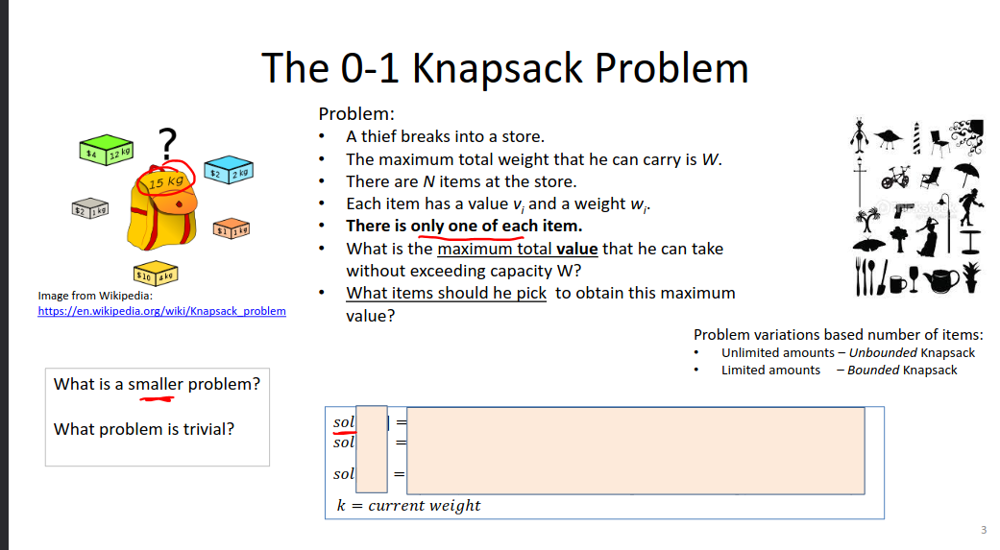
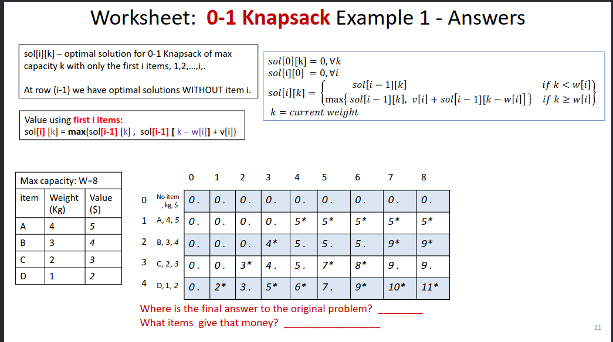
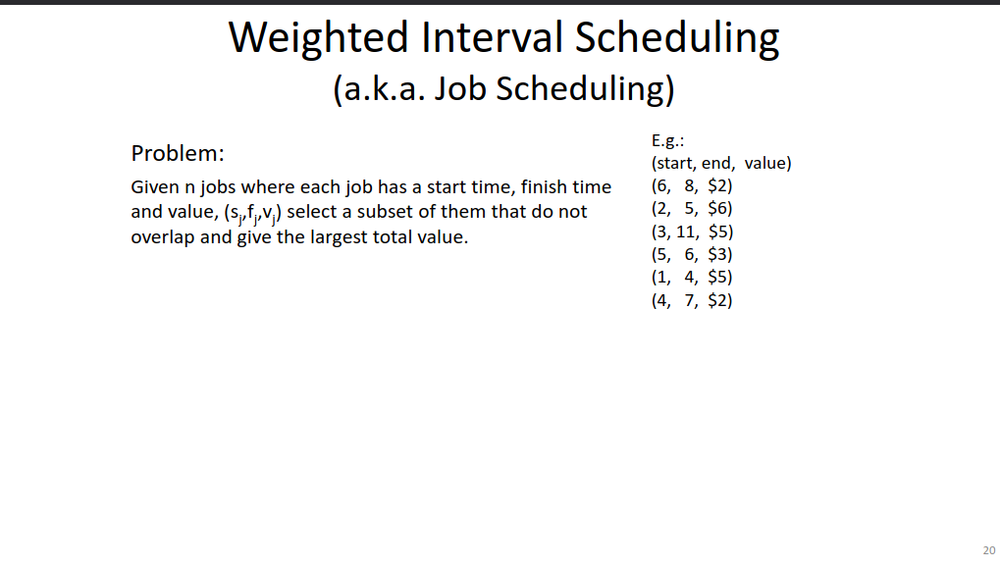
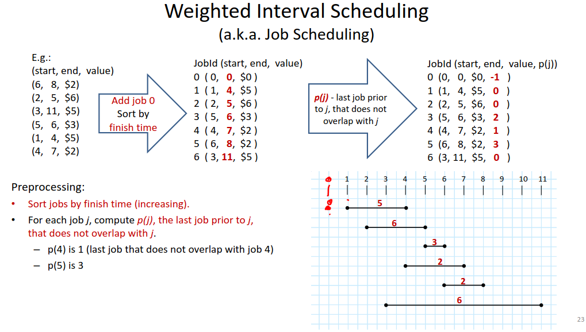
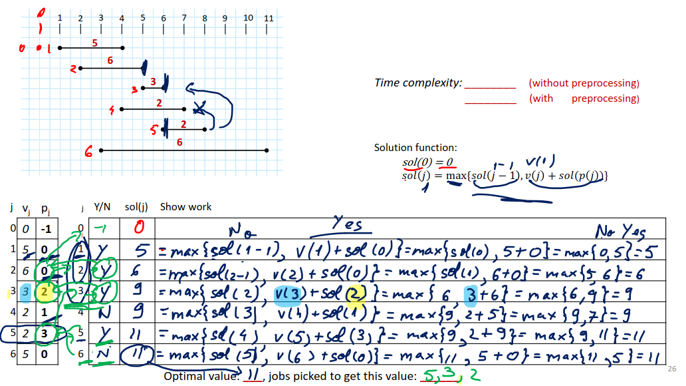

# Amortized Analysis
## Amortized cost

<badge type="info" text="Amorotized = cost of 1 operation" />

Amorotized cost = total cost of the operation / N
* cost can be: TC, SC

| ex | cost |
| -- | -    |
| OP1| 1    |
| OP2| 2    |
| OP3| 3    |
| OP4| 1    |
| OP5| 5    |
| OP6| 1    |
| OP7| 1    |  

$$
Total cost = 1+2+3+1+5+1+1  = 14
$$
$$
Amortized cost = 14/7 = 2
$$

can have O(#)

## Resizing Arrays
* insert 1 to 9
* if space cost to write = 1
* if arr full resize
  * double space
  * copy old to new

| Cost | Add | Visual of Current space allocated                        |
| ---- | --- | ------                                                   |
|  1   |  1  |                                                          |
| 1+1  |  2  | [1] Full                                                 |
| 2+1  |  3  | [1][2] Full                                              |
|  1   |  4  | [1][2][3][4]                                             |
| 4+1  |  5  | [1][2][3][4][5][6][7][8]                                 |
|  1   |  6  | [1][2][3][4][5][6][7][8]                                 |
|  1   |  7  | [1][2][3][4][5][6][7][8]                                 |
|  1   |  8  | [1][2][3][4][5][6][7][8]                                 |
| 8+1  |  9  | [1][2][3][4][5][6][7][8][9][10][11][12][13][14][15][16]  |

Amortized cost:

copy cost = 1+2+4+8 = 14
$$
\frac{TTC}{N} = \frac{copy + N + write 1}{N} = \frac{14 + 9 * θ(1)}{9} 
$$

General form:

All copy cost:
$$
All cost = 1+2+4+8+...\frac{N}{4}+\frac{N}{2} = 2n = 1 = θ(N)
$$

Amortized cost:
$$
\frac{total cost}{N} = \frac{all copy + N * write 1}{N} = \frac{θ(N)+ θ(1)}{θ(N)} = θ(1)
$$

## Dynamic Programming

Dynamic Programming (DP) applies when a problem has both of these properties
1. Optimal substructure: "Optimal solutions to a problem incorprate optimal solutions to related subproblems, which we may <u>Solve independtly</u>"
2. Overlapping subproblems: "a recursive algorithm <u>revists/repeats</u> the same problem repeatedly"

Dynamic programming is used to:
* solve ***optimization*** problems that have the above properties
* solve ***counting*** problems (e.g. matrix traversal)
* Speed up existing ***recursive*** implementations of problems that have ***overlapping subproblems*** (e.g. Fibonacci sequence)

<badge type="info" text="Bottom up tends to be the best efficient solution!"/>

* Top down is usually the recursive way of solving these problems which have exponential time, 
* **a better way of doing top down is a memoization version of it, saving values you have used already.**

### Steps to get a iterative (bottom up) solution

1. **Identify trivial problem**
   1. typically where the size is 0
2. Look at the **last step/choice** in an optimal solution:
   1. Assuming an optimal solution, what is the last action in completing it?
   2. Are there more than one options for the last action?
   3. If you consider each action, what is the **smaller problem that you would combine with the last action**?
      1. Assume that you have the optimal answer to that smaller problem.
   4. Generate all these solutions
   5. Compute the value (gain or cost) for each of these solutions.
   6. Keep the optimal one (**max or min** based on the problem)
3. Make a **1D or 2D array** and start filling in the answers from smallest to largest problem

### I'll just list the slides here because Prof. Stefan does a better job than i could do with my notes

## Knapsack Problem





<badge type="info" text=". = not taken and * = taken" />

### Knapsack code
```
int knapsack01(int W, int n, int * v, int *w)
{
    int with_i = 0;
    int sol[n+1][W+1]; // create sol arr n+1 rows and W+1 cols
    for (int k = 0; k<=W; k++)
    {
        sol[0][k] = 0; //loop through arr 1 setting all 0 row position first
    }

    for(int i = 1; i<=n; i++) //loop through rows
    {
        for(int k=0; k<=W; k++) //loop through columns
        {
            sol[i][k] = sol[i-1][k]; //without item i
            if(k > w[i]) // if current weight > capacity
            {
                with_i = v[i]+sol[i-1][k-w[i]]; 
                if(sol[i][k] < with_i) // if current sol val < with_i
                {
                    sol[i][k] = with_i; //take with item i
                }
            }
        }
    }
    return sol[n][W]; //return solution
}
```
* Time: Θ(nW) 
* Space: Θ(nW) 
* pseudo polynomial in W // need Θ(n) bits to store n items (values and weights) , but only log_2(W) bits to store W

### Improving the memory usage
* Optimize the memory usage by **Storing only smaller problems that are needed**
  * store either 2 rows or 2 columns
  * **The choices cannot be recovered anymore (i.e. cannot reocver what items to pick to achieve the computed value)**
* Space complexity: Θ(W)

## Job Scheduling



<badge type="info" text="First arrow does NlgN TC, 2nd arrow does either N^2 linear NlgN Binary search" />

Problem:
- Given n jobs where each job has a start time, finish time and value, (sj,fj,vj) select a subset of them that do not overlap and give the largest total value.

Preprocessing:
* **Sort jobs in increasing order of their finish time. (what the last slide did)**
* For each job, j, compute the last job prior to j, p(j) that does not overlap with j.

Solve the problem:
* Steps: one step for each job
* Choice: Pick/Don't
* Smaller problems: 2:
  * pb1 = jobs 1 to j-1 => sol(j-1)
  * pb2 = jobs 1 to p(j) (where p(j) is the last job before j that doesnt overlap with j. => sol(p(j)))
* Solution function (**Gives money value: sol(j) = the most money we can make with using jobs 1,2,...,j**)
$$sol(0)=0$$
$$sol(j) = max(sol(j-1),v(j) + sol(p(j)))$$
* Time Complexity:
  * O(n) (if data is preprocessed)
  * O(nlgn) (with preprocessing)



* Pj tells us what sol(j) doesnt overlap
* Vj is value of that job
* j is idx or Job #
* Basically what we are saying is: was my previous choice better or is the new choice better?


## 2-3-4 Trees
<badge type="info" text="This was voted to be put on exam 2 rather than the first, though idk if we should've done that..." />

Insertion & Deletion TC: O(lgN)

* 2-Nodes: 1 item, 2 children
* 3-Nodes: 2 item, 3 children
* 4-Nodes: 3 item, 4 children

keys in left: <= k; keys in right: > k

All leaves must be at same level, a node that isnt a leaf will have all children around that item (no gaps) (grows and shrinks from root)

<badge type="info" text="This is how a filled one looks like" />


<badge type="info" text="This is how individual nodes look like" />


### Time complexity:
$$
O(log_4(\frac{N}{3})) => O(lgN) =>  θ(lgN)
$$

Insertion when not full:
* Easy to do just put it where it needs to be
Insertion when full:
* We have to do a split.
* Take the middle item put it to the parent

<badge type="info" text="This is how they split" />


<badge type="info" text="This is step by step insertion" />

