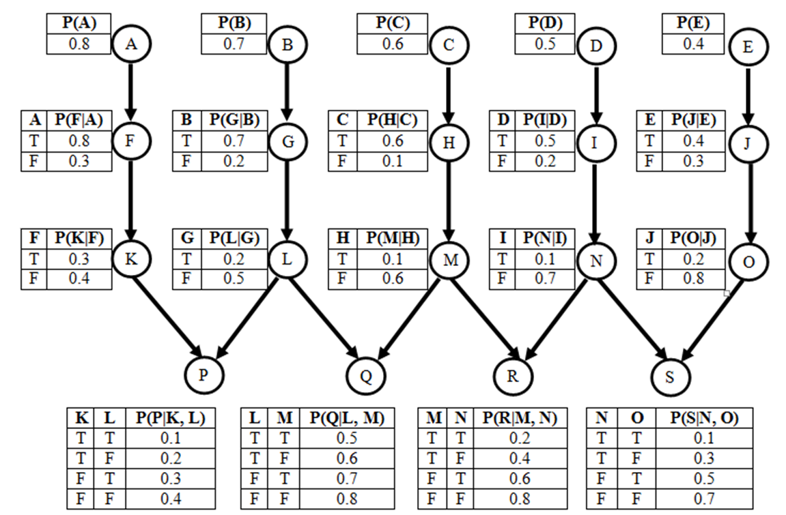

# Task 4

## Questions

### **Part a**: 
On the network shown above, what is the Markovian blanket of node L?

### **Part b**: 
On the network shown above, what is P(A, F)? How is it derived?

### **Part c**: 
On the network shown above, what is P(M, not(C) | H)? How is it derived?

Note: You do not have to use Inference by Enumeration for parts b and c.

## Answers 

### Part a
Markovian blanket of L  
Parents: G  
Children: P,Q  
Children's other parents: K, M  

So G, P, Q, K, M  

### Part b
$P(A,F) = P(\frac{F}{A} P(A))$ \
$P(A,F) = 0.8 \times 0.8$ \
$P(A,F) = 0.64$ 

### Part c 
$P(M, \neg C | H) = \frac{P(M,\neg C, H)}{P(H)}$  

$P(M, \neg C | H) = \frac{P(\frac{M}{H})*P(\frac{H}{\neg C})*P(\neg C)}{P(H \wedge C)+P(H \wedge \neg C)}$  

$P(M, \neg C | H) = \frac{P(\frac{M}{H})*P(\frac{H}{\neg C})*P(\neg C)}{P(\frac{H}{C})P(C)+P(\frac{H}{\neg C})P(\neg C)}$

$P(M, \neg C | H) = \frac{0.1 \times 0.1 \times 0.4}{0.6 \times 0.6 + 0.1 \times 0.4}$

$P(M, \neg C | H) = \frac{0.004}{0.4}$

$P(M, \neg C | H) = 0.01$